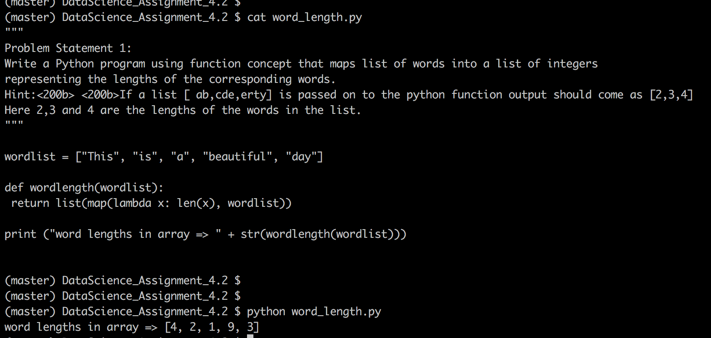

# Problem Statement :
```
#### Problem Statement​ ​1:
Write a Python program using function concept that maps list of words into a list of integers
representing the lengths of the corresponding words.
Hint:​ ​If a list [ ab,cde,erty] is passed on to the python function output should come as [2,3,4]
Here 2,3 and 4 are the lengths of the words in the list.
#### Problem Statement​ ​2:
Write a Python function which takes a character (i.e. a string of length 1) and returns True if it is
a vowel, False otherwise.
```

## Snapshot - class concepts implementation





